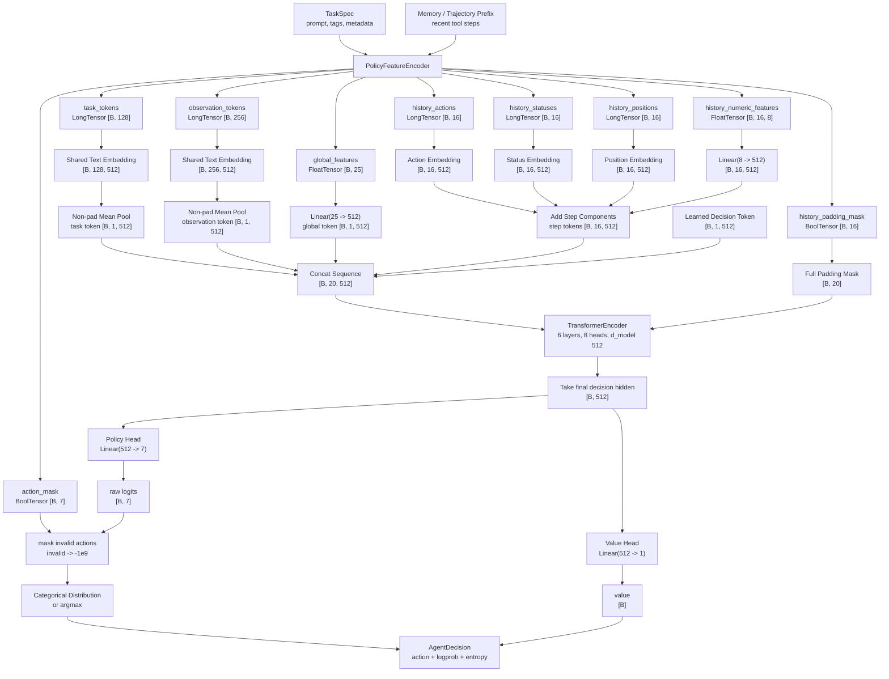
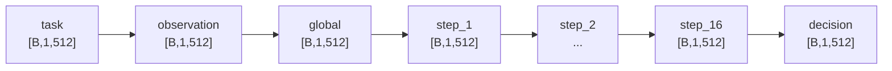
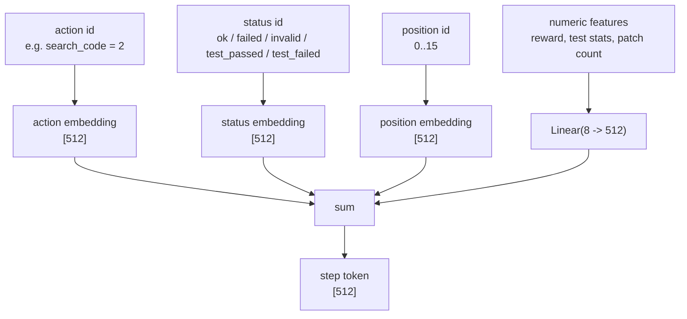
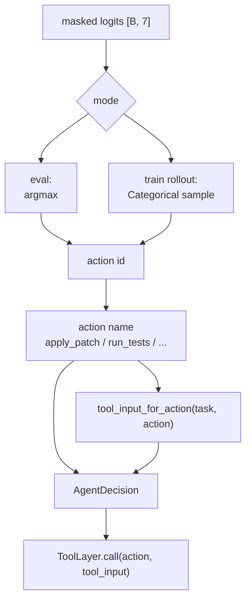
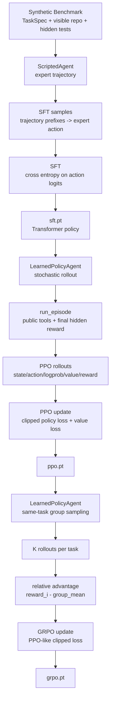
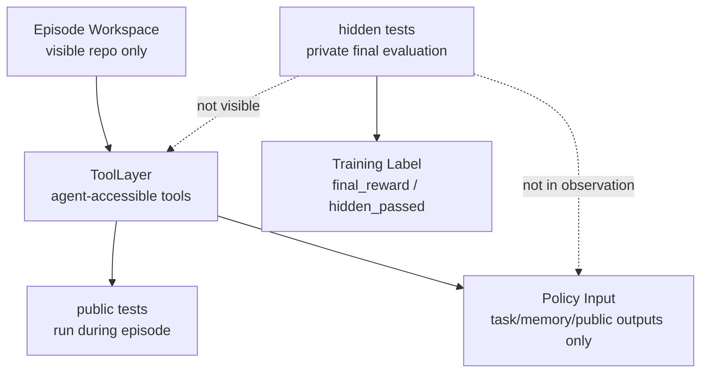

# Policy Network Architecture

这份文档用图说明当前高层 tool policy 的网络结构。它对应代码：

```text
src/agentic_code_rl/policy.py
src/agentic_code_rl/agents.py:LearnedPolicyAgent
src/agentic_code_rl/training.py
```

完整输入输出逐字段说明见 [POLICY_NETWORK_IO_WALKTHROUGH.md](POLICY_NETWORK_IO_WALKTHROUGH.md)。

## 1. 总体结构



## 2. Sequence Layout

Transformer 输入序列固定为：

```text
[ task, observation, global, step_1, step_2, ..., step_16, decision ]
```

shape：

```text
[B, 20, 512]
```

图：



对于 `task_001` 的三步历史：

```text
真实历史:
list_files -> search_code -> read_file

右对齐到 16 个 step slot:
PAD PAD PAD PAD PAD PAD PAD PAD PAD PAD PAD PAD PAD list_files search_code read_file
```

padding mask：

```text
task        False
observation False
global      False
13 PAD      True
3 real step False
decision    False
```

## 3. Sequence Elements

这一节解释 Transformer sequence 中每个元素是什么，以及为什么需要它。

完整 sequence 是：

```text
[ task, observation, global, step_1, step_2, ..., step_16, decision ]
```

### 3.1 `task`

`task` 是任务级文本 token，被压缩成一个向量：

```text
task token: [B, 1, 512]
```

它来自 `TaskSpec`：

```text
prompt
function_name
target_file
tags
```

以 `task_001` 为例：

```text
Fix prime detection for edge cases.
function: is_prime
target_file: src/buggy_lib.py
tags: logic edge-case
```

为什么需要它：

```text
task token 告诉 policy 当前要解决的是什么问题。
没有 task token，policy 只能看工具历史，不知道当前 bug 类型、目标函数或目标文件。
```

它帮助 policy 学到类似：

```text
如果任务有明确 target_file，read_file 应该读这个文件。
如果任务有 function_name，search_code 应该搜索这个函数。
不同 tag 的任务可能需要不同的工具顺序。
```

### 3.2 `observation`

`observation` 是当前可见观察文本，被压缩成一个向量：

```text
observation token: [B, 1, 512]
```

它来自当前 memory 的最近工具输出摘要，通常包含最近 3 步：

```text
Task: ...
Recent tool history:
- list_files: ...
- search_code: ...
- read_file: ...
```

以 `task_001` 在三步后为例：

```text
Recent tool history:
- list_files: README.md src/buggy_lib.py tests/test_public.py
- search_code: README.md:5 Target function: is_prime src/buggy_lib.py:1 def is_prime(n)
- read_file: def is_prime(n): if n == 2: return True ...
```

为什么需要它：

```text
observation token 保存最近工具输出的语义内容。
```

`global` 和 `step` 特征只告诉模型“做过什么、成功没成功、失败数是多少”，但不能表达：

```text
文件名具体是什么
函数名具体是什么
read_file 看到的代码大概是什么
search_code 匹配到了哪些路径
public test output 的文本摘要是什么
```

这些信息进入 `observation token`。

注意：

```text
observation 不包含 hidden test 文件内容。
```

### 3.3 `global`

`global` 是当前 episode 状态的结构化数值摘要：

```text
global token: [B, 1, 512]
```

它来自 25 维 `global_features`，例如：

```text
step_index_norm
remaining_steps_norm
action counts
has_read_target
has_applied_patch
has_run_public_tests
last_tool_ok
last_tool_invalid
last_public_test_passed
invalid_tool_calls_norm
syntax_or_import_errors_norm
```

以 `task_001` 三步后为例：

```text
step_index_norm = 3 / 12
has_listed_files = 1
has_searched_code = 1
has_read_target = 1
has_applied_patch = 0
has_run_public_tests = 0
last_tool_ok = 1
```

为什么需要它：

```text
global token 给 policy 一个稳定、低噪声的状态摘要。
```

它让模型不用只靠文本推断这些逻辑状态：

```text
现在是第几步？
还剩多少步？
是否已经读过目标文件？
是否已经 patch 过？
是否已经跑过 public tests？
最近工具是否 invalid？
```

这些状态对 tool policy 很关键。例如：

```text
has_applied_patch = 1 后，通常应该考虑 run_tests。
has_run_public_tests = 0 且已经 patch 后，不应该直接 finish。
last_tool_invalid = 1 时，可能需要换一种工具调用。
```

### 3.4 `step_1 ... step_16`

`step_1` 到 `step_16` 是历史工具调用 token：

```text
step tokens: [B, 16, 512]
```

每个 step token 由四部分相加：

```text
action embedding
status embedding
position embedding
numeric feature projection
```

例如一个 `search_code` step 可能包含：

```text
action = search_code
status = ok
position = 14
numeric = [-0.01, tool_ok=1, tool_invalid=0, ...]
```

以 `task_001` 三步后为例，16 个 step slot 是右对齐的：

```text
PAD PAD PAD PAD PAD PAD PAD PAD PAD PAD PAD PAD PAD list_files search_code read_file
```

为什么需要它：

```text
step tokens 保留完整的时间顺序。
```

`global token` 只知道统计摘要，比如 `read_file_count = 1`，但不知道：

```text
read_file 是刚刚发生，还是很早之前发生？
run_tests 是 patch 前跑的，还是 patch 后跑的？
inspect_failure 是否紧跟在失败测试之后？
是否陷入了 search/read/search/read 的循环？
```

这些时序关系由 `step_1...step_16` 表达。

为什么是 16 个：

```text
当前 synthetic tasks 的 max_steps 默认是 12。
Transformer history 设为 16，给后续更长 episode 留一点余量。
```

为什么右对齐：

```text
最近的 step 更靠近 decision token。
当 episode 超过 16 步时，保留最近 16 步，丢弃更早历史。
```

### 3.5 `decision`

`decision` 是一个可学习的特殊 token：

```text
decision token: [B, 1, 512]
```

它不是来自 task，也不是来自工具历史，而是模型参数：

```text
self.decision_token = nn.Parameter(...)
```

为什么需要它：

```text
decision token 是当前决策的聚合位置。
```

它的作用类似分类模型里的 `[CLS]` token：

```text
让这个 token attend 到 task、observation、global 和所有 step tokens。
Transformer 输出后，取 decision token 的 hidden state。
这个 hidden state 代表“当前应该做什么动作”的综合状态。
```

后续两个 head 都接在 `decision` 的 hidden state 上：

```text
policy_head(decision_hidden) -> 7 action logits
value_head(decision_hidden)  -> scalar value
```

没有 decision token 也可以选择用最后一个真实 step 或 mean pooling，但那样有两个问题：

```text
1. padding/history 长度变化时，取哪个位置不稳定。
2. mean pooling 会把任务、状态、历史混在一起，缺少一个专门用于决策的汇聚位置。
```

所以当前设计使用一个显式 `decision token`。

## 4. 为什么不只用其中一种输入

这几个元素分别解决不同问题：

| 元素 | 主要信息 | 解决的问题 |
|---|---|---|
| `task` | 任务描述、函数名、目标文件、tag | 当前要修什么 |
| `observation` | 最近工具输出文本 | 刚刚看到了什么 |
| `global` | 结构化状态摘要 | 当前处于什么阶段 |
| `step_1...step_16` | 有顺序的工具历史 | 之前按什么顺序做过什么 |
| `decision` | 可学习聚合 token | 汇总上下文并输出动作 |

如果只用 `task`：

```text
模型不知道已经做过哪些工具调用。
```

如果只用 `observation`：

```text
模型要从文本里艰难推断所有状态，训练更不稳定。
```

如果只用 `global`：

```text
模型看不到文件名、函数名、代码摘要、测试输出文本。
```

如果只用 `step`：

```text
模型知道工具顺序，但不知道任务语义。
```

因此当前设计把文本、结构化状态和时序历史都放进 Transformer。

## 5. Step Token 结构

每个历史 step token 由四部分相加：



当前 8 个 numeric features：

```text
reward_delta
tool_ok
tool_invalid
is_public_test
public_test_passed
failure_count_norm
passed_count_norm
patch_count_seen_norm
```

## 6. 输出动作和工具调用



Action id mapping：

```text
0 list_files
1 read_file
2 search_code
3 apply_patch
4 run_tests
5 inspect_failure
6 finish
```

Tool input is rule-generated:

```text
list_files      -> {}
read_file       -> {"path": target_file}
search_code     -> {"query": function_name}
apply_patch     -> expert patch provider for now
run_tests       -> {"scope": "public"}
inspect_failure -> {}
finish          -> {}
```

Important boundary:

```text
The policy chooses "apply_patch".
It does not generate the patch content.
```

## 7. Training Flow



## 8. Hidden-Test Boundary



Hidden tests never appear in:

```text
task_tokens
observation_tokens
global_features
history step tokens
action_mask
```

They only affect terminal reward after the runner finishes the episode.

## 9. Current Limitation

Current architecture trains:

```text
when to call tools
```

It does not train:

```text
what patch to write
```

So `apply_patch` currently remains a strong expert-backed action. This is acceptable for SFT smoke and tool-policy training, but it is not a full autonomous code repair model. The next major architecture extension should add a separate patch generator.
