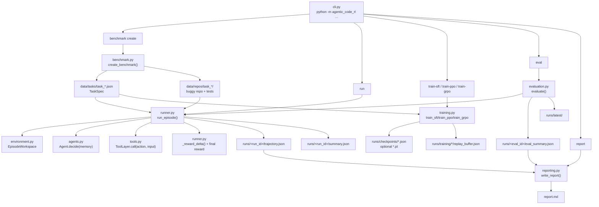
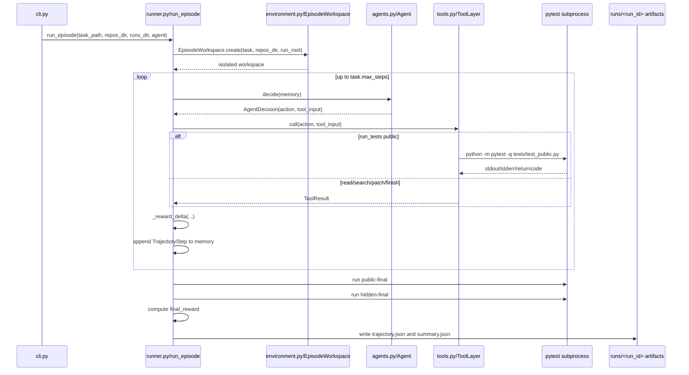
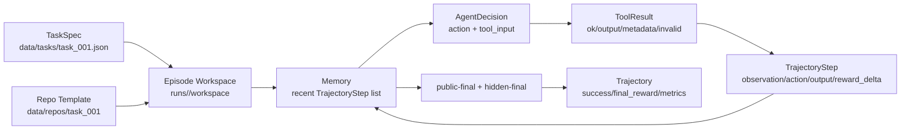

# Agentic Code RL 系统流程走读

这份文档用于学习 `agentic-code-rl` 仓库的系统设计。它不是 API 文档，而是按“一个任务如何从生成、运行、奖励、评测到训练”的顺序，把流程图、具体例子、文件和代码入口串起来。

## 1. 系统做的事情

这个仓库实现的是一个小型代码修复实验框架。这里的 harness 特指 SWE-bench-style evaluation/tool-execution harness：

```text
给 agent 一个 buggy Python repo
agent 通过工具读文件、搜索、打 patch、跑 public tests
runner 记录多轮 trajectory
episode 结束后用 hidden tests 给最终 reward
eval/report 汇总 agent 的表现
training 写 SFT/PPO/GRPO-style checkpoint
```

它的重点不是“已经训练出强模型”，而是先把 Agentic RL 所需的环境、动作、奖励、轨迹和评测闭环搭起来。

## 2. 顶层系统流程图



## 3. 运行时 episode 时序图

一次 `run` 命令会启动一个 episode。核心循环在 `runner.py:run_episode()`。



## 4. 核心文件地图

| 文件 | 关键代码 | 作用 |
|---|---|---|
| `src/agentic_code_rl/schemas.py` | `TaskSpec`, `AgentDecision`, `TrajectoryStep`, `Trajectory` | 定义任务、动作、工具结果、轨迹等系统数据结构 |
| `src/agentic_code_rl/benchmark.py` | `FunctionCase`, `create_benchmark()`, `_write_repo()` | 生成 synthetic buggy repo、public tests、hidden tests 和 expert patch |
| `src/agentic_code_rl/environment.py` | `EpisodeWorkspace.create()`, `resolve_path()`, `run_tests()` | 创建隔离 workspace，防路径逃逸，用 pytest 执行测试 |
| `src/agentic_code_rl/tools.py` | `ToolLayer.call()`, `apply_patch()`, `run_tests()`, `inspect_failure()` | 把 agent 的结构化 action 转成真实文件/测试操作 |
| `src/agentic_code_rl/agents.py` | `ScriptedAgent`, `ReactAgent`, `LearnedPolicyAgent` | 决定下一步工具动作 |
| `src/agentic_code_rl/runner.py` | `run_episode()`, `_reward_delta()` | 多轮交互主循环、reward、trajectory 落盘 |
| `src/agentic_code_rl/training.py` | `train_sft()`, `train_ppo()`, `train_grpo()` | 写 SFT/PPO/GRPO-style checkpoint 和 replay buffer |
| `src/agentic_code_rl/evaluation.py` | `evaluate()`, `summarize_trajectories()` | 批量跑任务并汇总指标 |
| `src/agentic_code_rl/reporting.py` | `write_report()` | 从单条 trajectory 或 eval summary 生成 Markdown 报告 |
| `src/agentic_code_rl/cli.py` | `main()` | 命令行入口，把命令分发到各模块 |

## 5. 例子一：`benchmark create` 如何生成任务

命令：

```powershell
python -m agentic_code_rl benchmark create --out data/tasks --count 3 --overwrite
```

入口：

```text
src/agentic_code_rl/cli.py
  main()
    -> create_benchmark(args.out, repos_out=args.repos_out, count=args.count, overwrite=args.overwrite)
```

核心实现：

```text
src/agentic_code_rl/benchmark.py
  FunctionCase
  create_benchmark()
  _write_repo()
```

`FunctionCase` 是任务模板。每个 case 里面有：

```python
slug: str
function_name: str
prompt: str
buggy_source: str
fixed_source: str
public_tests: str
hidden_tests: str
tags: tuple[str, ...]
```

例如 `prime_edges` 任务里，buggy 版本对 `n < 2` 没有正确处理。`create_benchmark()` 会把它写成：

```text
data/tasks/task_001.json
data/repos/task_001/src/buggy_lib.py
data/repos/task_001/tests/test_public.py
data/hidden_tests/task_001/tests/test_hidden.py
data/expert_patches/task_001/patch.json
```

`task_001.json` 是 `TaskSpec`：

```json
{
  "id": "task_001",
  "repo_template": "task_001",
  "prompt": "Fix prime detection for edge cases.",
  "public_tests": ["tests/test_public.py"],
  "hidden_tests": ["tests/test_hidden.py"],
  "max_steps": 12,
  "tags": ["logic", "edge-case"],
  "metadata": {
    "function_name": "is_prime",
    "target_file": "src/buggy_lib.py",
    "source_case": "prime_edges"
  }
}
```

学习重点：

- `public_tests` 是 episode 内 agent 可用的反馈。
- `hidden_tests` 只在 final evaluation 运行，文件不在 visible workspace 内。
- `expert_patch` 是单独的 synthetic expert artifact，不在 task JSON 中暴露。

## 6. 例子二：`scripted` agent 如何完成一次修复

命令：

```powershell
python -m agentic_code_rl run --task data/tasks/task_001.json --agent scripted --run-id learn-scripted
```

入口：

```text
src/agentic_code_rl/cli.py
  main()
    -> create_agent("scripted")
    -> run_episode(...)
```

agent 决策代码：

```text
src/agentic_code_rl/agents.py
  ScriptedAgent.decide(memory)
```

它的固定策略是：

```text
list_files
-> search_code(function_name)
-> read_file(target_file)
-> apply_patch(synthetic expert patch)
-> run_tests(scope="public")
-> finish
```

这段逻辑来自 `ScriptedAgent.decide()`：

```python
if counts["list_files"] == 0:
    return AgentDecision("list_files", rationale="Inspect repository layout.")
if counts["search_code"] == 0 and function_name:
    return AgentDecision("search_code", {"query": function_name}, rationale="Find the target function.")
if counts["read_file"] == 0:
    return AgentDecision("read_file", {"path": target_file}, rationale="Read target source file.")
if counts["apply_patch"] == 0 and expert_patch:
    return AgentDecision("apply_patch", expert_patch, rationale="Apply known expert repair.")
if counts["run_tests"] == 0:
    return AgentDecision("run_tests", {"scope": "public"}, rationale="Verify public tests.")
return AgentDecision("finish", rationale="Stop after verification.")
```

runner 主循环在 `runner.py:run_episode()`：

```python
for _ in range(task.max_steps):
    observation = memory.observation()
    decision = agent.decide(memory)
    result = tools.call(decision.action, decision.tool_input)
    reward_delta = _reward_delta(decision.action, result.metadata, result.invalid, reward_state)
    memory.steps.append(step)
    if decision.action == "finish":
        break
```

执行结束后会写：

```text
runs/learn-scripted/workspace/
runs/learn-scripted/trajectory.json
runs/learn-scripted/summary.json
```

你读 `trajectory.json` 时重点看：

```text
steps[].observation
steps[].action
steps[].tool_input
steps[].tool_output
steps[].reward_delta
final_reward
hidden_passed
```

## 7. 例子三：hidden tests 为什么不会泄漏给 agent

代码修复 evaluation harness 最重要的边界之一是：

```text
episode 内只能跑 public tests
episode 内也不能读、搜 hidden tests
hidden tests 只在 final evaluation 运行
```

这个边界由 `ToolLayer.run_tests()` 实现：

```text
src/agentic_code_rl/tools.py
  ToolLayer.run_tests(scope)
```

关键代码逻辑：

```python
if scope in {"hidden", "all"}:
    if not self.allow_hidden_tests:
        return ToolResult("run_tests", False, "Hidden and all-test runs are reserved for final evaluation.", invalid=True)
```

runner 创建 tool layer 时显式关闭 hidden tests：

```python
tools = ToolLayer(context, test_timeout_sec=test_timeout_sec, allow_hidden_tests=False)
```

最终 hidden tests 在 `runner.py:run_episode()` 末尾由环境直接运行：

```python
public_result = workspace.run_tests(task.public_tests, scope="public-final", timeout_sec=test_timeout_sec)
hidden_result = workspace.run_tests(task.hidden_tests, scope="hidden-final", timeout_sec=test_timeout_sec)
```

对应测试在：

```text
tests/test_core.py
  test_workspace_path_guard_and_public_hidden_boundary()
```

这个测试验证两件事：

- `workspace.run_tests(task.hidden_tests, scope="hidden")` 本身可以从私有 hidden source 运行 hidden tests。
- 但 agent 通过 `ToolLayer(... allow_hidden_tests=False)` 调 `run_tests hidden/all` 会被拒绝。
- `list_files`、`read_file`、`search_code` 不会暴露 `tests/test_hidden.py`。

学习重点：

```text
ToolLayer 是 agent 能接触的接口。
EpisodeWorkspace 是 evaluation harness 内部评测接口。
hidden tests 只能被 runner final evaluation 使用。
```

## 8. 例子四：bad patch 如何被惩罚

测试文件里有一个专门的坏 agent：

```text
tests/test_core.py
  BadPatchAgent
  test_syntax_error_patch_is_penalized()
```

它的动作序列是：

```python
[
    AgentDecision("read_file", {"path": "src/buggy_lib.py"}),
    AgentDecision("apply_patch", {"path": "src/buggy_lib.py", "content": "def broken(:\n"}),
    AgentDecision("run_tests", {"scope": "public"}),
    AgentDecision("finish"),
]
```

这会把目标文件改成语法错误。然后 `run_tests` 触发 pytest，pytest 返回错误码。

reward 逻辑在：

```text
src/agentic_code_rl/runner.py
  _reward_delta()
```

关键逻辑：

```python
if action == "run_tests":
    if metadata.get("scope") == "public":
        ...
        if int(metadata.get("returncode", 0)) in {2, 4}:
            state.syntax_or_import_errors += 1
            reward -= 0.1
```

测试断言：

```python
assert not trajectory.success
assert trajectory.metrics["syntax_or_import_errors"] >= 1
assert trajectory.final_reward < 0.5
```

学习重点：

- bad patch 不是在 `apply_patch` 阶段立刻知道错，而是在 `run_tests` 阶段通过环境反馈暴露。
- 这是典型 Agentic RL：动作后果通过环境 observation/reward 体现。
- 后续如果做 PPO/GRPO，这类失败轨迹应该进入 replay/failure classifier。

## 9. 例子五：训练、评测、报告怎么串起来

### 9.1 SFT/PPO/GRPO training

命令：

```bash
python -m agentic_code_rl train-sft --config configs/sft.yaml
python -m agentic_code_rl train-ppo --config configs/ppo.yaml
python -m agentic_code_rl train-grpo --config configs/grpo.yaml
```

入口：

```text
src/agentic_code_rl/cli.py
  train-sft  -> training.py:train_sft()
  train-ppo  -> training.py:train_ppo()
  train-grpo -> training.py:train_grpo()
```

当前训练模块训练的是 Transformer tool policy：

- `train_sft()` 从 scripted expert trajectory 采集决策点，用交叉熵训练 policy warm start。
- `train_ppo()` 用当前 policy 采样 episode，按 reward 计算 advantage，并用 clipped PPO objective 更新。
- `train_grpo()` 对同一 task 采样一组 trajectory，用组内相对 reward 更新 policy。

输出：

```text
runs/checkpoints/sft.json
runs/checkpoints/sft.pt
runs/checkpoints/ppo.json
runs/checkpoints/ppo.pt
runs/checkpoints/grpo.json
runs/checkpoints/grpo.pt
runs/training/*/replay_buffer.json
```

`LearnedPolicyAgent` 优先读取 `.pt` checkpoint；JSON checkpoint 保留 metadata 和 fallback action scores：

```text
src/agentic_code_rl/agents.py
  LearnedPolicyAgent.__init__()
  LearnedPolicyAgent.decide()
```

`.pt` 路径会把当前 `TaskSpec + Memory` 编码成 policy batch，然后用网络输出 action logits：

```text
TaskSpec + trajectory prefix
  -> PolicyFeatureEncoder
  -> TrajectoryTransformerPolicy
  -> masked logits [7]
  -> AgentDecision(action, logprob, entropy)
```

### 9.2 Eval

命令：

```powershell
python -m agentic_code_rl eval --config configs/eval.yaml --agent scripted
```

入口：

```text
src/agentic_code_rl/evaluation.py
  evaluate()
```

它会：

```text
读取 configs/eval.yaml
遍历 data/tasks/task_*.json
每个 task 调 run_episode()
汇总 metrics
写 runs/<eval_id>/eval_summary.json
复制到 runs/latest
```

指标由 `summarize_trajectories()` 计算：

```text
pass_at_1
hidden_pass_rate
public_pass_rate
avg_tool_calls
invalid_patch_rate
syntax_error_rate
avg_api_cost_usd
avg_duration_sec
```

### 9.3 Report

命令：

```powershell
python -m agentic_code_rl report --run runs/latest
```

入口：

```text
src/agentic_code_rl/reporting.py
  write_report()
```

如果目录里有 `eval_summary.json`，生成 evaluation report。

如果目录里有 `trajectory.json`，生成 single episode report。

## 10. 一条完整数据流



## 11. 你学习这个仓库时的阅读顺序

建议按这个顺序读代码：

1. `schemas.py`：先理解数据结构。
2. `benchmark.py`：理解任务怎么生成。
3. `environment.py`：理解 workspace 和 pytest。
4. `tools.py`：理解 agent 能调用什么。
5. `agents.py`：理解 agent 怎么选动作。
6. `runner.py`：理解完整 episode。
7. `evaluation.py` 和 `reporting.py`：理解评测。
8. `policy.py`：理解 tool policy 的输入编码和 Transformer 网络。
9. `training.py`：理解 SFT/PPO/GRPO 如何采集 rollout 并更新 policy。
10. `tests/test_core.py`：看系统约束如何被测试覆盖。

## 12. 当前实现边界

学习时必须分清当前已经实现和还没实现的部分。

已经实现：

- synthetic benchmark generation
- isolated workspace
- guarded tool layer
- public/hidden test boundary
- scripted baseline
- optional ReAct LLM planner入口
- trajectory logging
- eval/report
- Transformer tool policy
- SFT/PPO/GRPO training
- learned `.pt` checkpoint inference
- pytest 覆盖核心边界

尚未真正实现：

- 强 LLM patch generation 闭环
- patch generator 训练
- failure classifier
- experiment registry
- multi-run comparison report

## 13. 下一步最适合补的功能

按学习和项目价值排序：

1. 给 `ReactAgent` 增加真实 patch generation，并记录 `fallback_used`。
2. 训练 patch generator，逐步替换 expert patch provider。
3. 增加 `failure_type` 字段和 failure classifier。
4. 增加 experiment registry 和多 agent 对比报告。
5. 扩展 synthetic benchmark 难度和任务数量。
