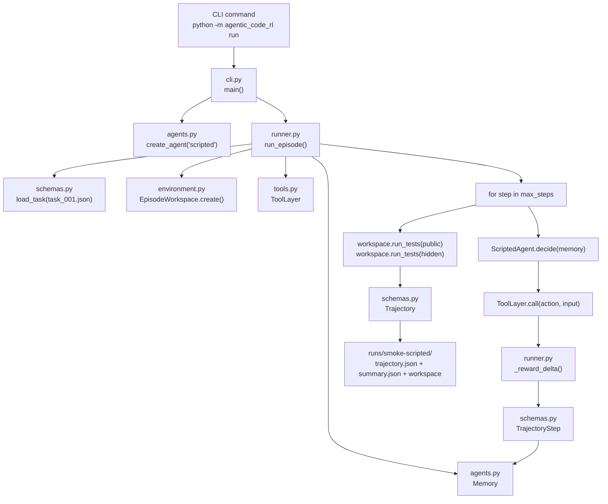

# task_001.json 完整处理流程与原理

这篇文档只讲一个任务：`data/tasks/task_001.json`。

目标不是再重复系统总览，而是把一个 episode 从命令入口、任务加载、workspace 复制、agent 决策、工具执行、patch 应用、public/hidden 测试、reward 计算、trajectory 落盘完整串起来。读完后，你应该能回答：

- `task_001.json` 到底描述了什么 bug。
- 代码从哪个入口开始运行。
- agent 每一步为什么选择那个 tool。
- tool 怎么影响 workspace。
- reward 为什么最后是 `1.74`。
- 当前哪些部分属于 SWE-bench-style evaluation harness，哪些只是 agent runtime / training scaffold。
- hidden-test 边界和 expert patch 边界是如何被隔离的。

## 1. 任务本体：task_001.json 是什么

文件位置：

```text
data/tasks/task_001.json
```

真实内容核心如下：

```json
{
  "id": "task_001",
  "repo_template": "task_001",
  "prompt": "Fix prime detection for edge cases.",
  "public_tests": ["tests/test_public.py"],
  "hidden_tests": ["tests/test_hidden.py"],
  "max_steps": 12,
  "tags": ["logic", "edge-case"],
  "metadata": {
    "function_name": "is_prime",
    "target_file": "src/buggy_lib.py",
    "source_case": "prime_edges"
  }
}
```

它不是一个自然语言孤立任务，而是一个完整的 benchmark spec。它把一次 code repair episode 需要的所有边界都定义好了：

| 字段 | 作用 | 在本任务中的值 |
| --- | --- | --- |
| `id` | 任务唯一 ID | `task_001` |
| `repo_template` | 要复制的 buggy repo 模板目录 | `data/repos/task_001` |
| `prompt` | 给 agent 的任务描述 | `Fix prime detection for edge cases.` |
| `public_tests` | episode 内允许运行的测试 | `tests/test_public.py` |
| `hidden_tests` | episode 结束后用于最终评测的测试 | `tests/test_hidden.py` |
| `max_steps` | 最多工具调用轮数 | `12` |
| `metadata.function_name` | 给 scripted/policy/LLM agent 的定位提示 | `is_prime` |
| `metadata.target_file` | 默认目标源码文件 | `src/buggy_lib.py` |
| `metadata.source_case` | synthetic baseline 定位用的 case id，不是补丁答案 | `prime_edges` |

专家补丁不在 task JSON 中暴露。benchmark 会把它作为单独 artifact 写到：

```text
data/expert_patches/task_001/patch.json
```

对应的数据结构在：

```text
src/agentic_code_rl/schemas.py
```

关键类是 `TaskSpec`：

```python
@dataclass(slots=True)
class TaskSpec:
    id: str
    repo_template: str
    prompt: str
    public_tests: list[str]
    hidden_tests: list[str]
    max_steps: int = 12
    tags: list[str] = field(default_factory=list)
    metadata: dict[str, Any] = field(default_factory=dict)
```

命令运行时，`load_task()` 会把 JSON 解析成这个 `TaskSpec`。

## 2. 这个 bug 到底是什么

模板 repo 在：

```text
data/repos/task_001
```

源码文件：

```text
data/repos/task_001/src/buggy_lib.py
```

原始 buggy 代码：

```python
def is_prime(n):
    if n == 2:
        return True
    for divisor in range(2, n):
        if n % divisor == 0:
            return False
    return True
```

这个实现有两个层面的缺陷。

第一，`n < 2` 时会错误返回 `True`：

```text
is_prime(1)  -> True
is_prime(0)  -> True
is_prime(-7) -> True
```

原因是 `range(2, n)` 对这些输入为空，循环不会执行，函数直接走到最后的 `return True`。

第二，效率很低：

```python
for divisor in range(2, n)
```

它会检查到 `n - 1`，更合理的是只检查到 `sqrt(n)`，并跳过偶数。

所以专家修复是：

```python
def is_prime(n):
    if n < 2:
        return False
    if n == 2:
        return True
    if n % 2 == 0:
        return False
    divisor = 3
    while divisor * divisor <= n:
        if n % divisor == 0:
            return False
        divisor += 2
    return True
```

## 3. Public 和 Hidden 测试的真实边界

public tests：

```text
data/repos/task_001/tests/test_public.py
```

内容是：

```python
from buggy_lib import is_prime

def test_common_primes_and_composites():
    assert is_prime(2)
    assert is_prime(3)
    assert not is_prime(4)
```

这些测试只覆盖普通质数和普通合数。注意：原始 buggy 实现已经能通过这些 public tests。

hidden tests：

```text
data/hidden_tests/task_001/tests/test_hidden.py
```

内容是：

```python
from buggy_lib import is_prime

def test_prime_edges():
    assert not is_prime(1)
    assert not is_prime(0)
    assert not is_prime(-7)
    assert is_prime(97)
```

hidden tests 才真正检查了本任务的核心 bug：`n < 2` 的边界，以及较大的质数 `97`。

这说明 `task_001` 的设计意图是：

```text
public tests 只能给 agent 部分反馈
hidden tests 才判断修复是否真的泛化
```

这就是代码修复 Agentic RL 里非常重要的 evaluation boundary：agent 不能只过 public tests，因为 public tests 可能很弱。

## 4. Hidden 边界现在如何实现

设计上，hidden tests 只用于最终 reward 和 evaluation。当前实现从两个层面做隔离。

第一，benchmark 生成时，visible repo 只包含源码和 public tests：

```text
data/repos/task_001/
  README.md
  src/buggy_lib.py
  tests/test_public.py
```

hidden tests 放在私有评测目录：

```text
data/hidden_tests/task_001/tests/test_hidden.py
```

第二，工具层禁止 agent 在 episode 内主动运行 hidden/all tests：

```python
def run_tests(self, scope: str = "public") -> ToolResult:
    if scope in {"hidden", "all"}:
        if not self.allow_hidden_tests:
            return ToolResult(
                "run_tests",
                False,
                "Hidden and all-test runs are reserved for final evaluation.",
                invalid=True,
            )
```

位置：

```text
src/agentic_code_rl/tools.py
```

`EpisodeWorkspace.create()` 只把 visible repo 复制到 episode workspace：

```python
shutil.copytree(repo_source, workspace_root)
```

位置：

```text
src/agentic_code_rl/environment.py
```

因此 workspace 里只包含：

```text
README.md
src/buggy_lib.py
tests/test_public.py
```

同时，`EpisodeWorkspace` 还会保存一个私有 hidden source：

```python
hidden_source = repos_dir.parent / "hidden_tests" / task.repo_template
```

这个 hidden source 不提供给 `list_files/read_file/search_code`，只给 runner 的 final evaluation 使用。

所以当前实现的真实状态是：

```text
hidden tests 的运行被隔离
hidden tests 的文件内容也被隔离
final evaluation 仍然可以从私有 hidden source 运行 hidden tests
```

这一点是 SWE-bench-style evaluation harness 的关键：agent 可以用 public feedback 迭代，但不能看到 hidden grading oracle。

## 5. 从命令到 episode 的调用链

运行一个单任务 episode：

```powershell
python -m agentic_code_rl run --task data/tasks/task_001.json --agent scripted --run-id smoke-scripted
```

如果当前机器默认 `python` 不是 3.11+，使用：

```powershell
py -3.11 -m agentic_code_rl run --task data/tasks/task_001.json --agent scripted --run-id smoke-scripted
```

调用链如下：



CLI 入口在：

```text
src/agentic_code_rl/cli.py
```

核心分支是：

```python
if args.command == "run":
    agent = create_agent(args.agent, checkpoint=args.checkpoint)
    trajectory = run_episode(
        task_path=args.task,
        repos_dir=args.repos_dir,
        runs_dir=args.runs_dir,
        agent=agent,
        run_id=args.run_id,
        test_timeout_sec=args.test_timeout_sec,
    )
```

所以 CLI 本身不做复杂逻辑，它只是：

1. 解析参数。
2. 创建 agent。
3. 把 task、repo、runs 目录交给 `run_episode()`。

## 6. Episode workspace 如何创建

`run_episode()` 的第一段逻辑：

```python
task = load_task(task_path)
run_root = runs_dir / (run_id or _default_run_id(task.id, agent.name))
if run_root.exists():
    shutil.rmtree(run_root)
run_root.mkdir(parents=True, exist_ok=True)

workspace = EpisodeWorkspace.create(task, repos_dir=repos_dir, runs_dir=run_root)
context = ToolContext(workspace)
tools = ToolLayer(context, test_timeout_sec=test_timeout_sec, allow_hidden_tests=False)
memory = Memory(task)
reward_state = RewardState()
```

位置：

```text
src/agentic_code_rl/runner.py
```

对于 `task_001`，这会形成：

```text
runs/smoke-scripted/
  workspace/
    README.md
    src/buggy_lib.py
    tests/test_public.py
  trajectory.json
  summary.json
```

`EpisodeWorkspace.create()` 的逻辑：

```python
repo_source = (repos_dir / task.repo_template).resolve()
workspace_root = base / "workspace"
shutil.copytree(repo_source, workspace_root)
```

对于 `task_001`：

```text
repos_dir = data/repos
task.repo_template = task_001
repo_source = data/repos/task_001
workspace_root = runs/smoke-scripted/workspace
```

这个复制非常关键。agent 后续所有文件操作都在 `runs/smoke-scripted/workspace` 内进行，不会直接修改 `data/repos/task_001` 模板。

路径安全由 `resolve_path()` 保证：

```python
def resolve_path(self, relative: str | Path) -> Path:
    raw = Path(relative)
    if raw.is_absolute():
        raise WorkspaceError(f"Absolute paths are not allowed: {relative}")
    resolved = (self.root / raw).resolve()
    try:
        resolved.relative_to(self.root)
    except ValueError as exc:
        raise WorkspaceError(f"Path escapes workspace: {relative}") from exc
    return resolved
```

这意味着 agent 不能通过下面这些路径越权：

```text
D:/Vibethon/...
../outside.py
../../.env
```

## 7. Agent 每一步如何决策

`scripted` agent 在：

```text
src/agentic_code_rl/agents.py
```

它不是最终算法成果，而是专家轨迹 baseline 和 smoke path。核心逻辑：

```python
if counts["list_files"] == 0:
    return AgentDecision("list_files", rationale="Inspect repository layout.")
if counts["search_code"] == 0 and function_name:
    return AgentDecision("search_code", {"query": function_name}, rationale="Find the target function.")
if counts["read_file"] == 0:
    return AgentDecision("read_file", {"path": target_file}, rationale="Read target source file.")
if counts["apply_patch"] == 0 and expert_patch:
    return AgentDecision("apply_patch", expert_patch, rationale="Apply known expert repair.")
if counts["run_tests"] == 0:
    return AgentDecision("run_tests", {"scope": "public"}, rationale="Verify public tests.")
return AgentDecision("finish", rationale="Stop after verification.")
```

对 `task_001` 来说，`metadata` 只提供定位信息：

```json
{
  "function_name": "is_prime",
  "target_file": "src/buggy_lib.py",
  "source_case": "prime_edges"
}
```

`ScriptedAgent` 通过 `source_case` 在 synthetic case library 中查找专家补丁。这个设计只服务于 smoke/SFT expert trace，不代表真实 ReAct agent 可以读取答案。

所以 scripted agent 的策略是固定的：

```text
list_files
-> search_code("is_prime")
-> read_file("src/buggy_lib.py")
-> apply_patch(synthetic expert patch)
-> run_tests(scope="public")
-> finish
```

这条轨迹的意义是：

- 验证工具层是否可用。
- 生成 SFT baseline 的专家行为格式。
- 给 PPO/GRPO 的早期训练提供可比较的成功轨迹。
- 不是为了证明 LLM 已经能自主修复。

## 8. 一次真实 task_001 episode 的逐步执行

下面用 `runs/smoke-scripted/trajectory.json` 中的真实结果解释。

### Step 1：list_files

agent 看到的初始 observation：

```text
Task: Fix prime detection for edge cases.
```

决策：

```json
{
  "action": "list_files",
  "tool_input": {},
  "rationale": "Inspect repository layout."
}
```

工具输出：

```text
README.md
src/buggy_lib.py
tests/test_public.py
```

reward：

```text
-0.01
```

原因：每次工具调用都有成本惩罚 `-0.01`。

### Step 2：search_code("is_prime")

Memory 生成新的 observation：

```text
Task: Fix prime detection for edge cases.
Recent tool history:
- list_files: README.md src/buggy_lib.py tests/test_public.py
```

决策：

```json
{
  "action": "search_code",
  "tool_input": {"query": "is_prime"},
  "rationale": "Find the target function."
}
```

工具执行位置：

```text
src/agentic_code_rl/tools.py
```

逻辑是遍历 workspace 下的 `.py/.md/.txt` 文件，然后正则匹配 query。

输出摘要：

```text
README.md:5: Target function: `is_prime`.
src/buggy_lib.py:1: def is_prime(n):
tests/test_public.py:4:     assert is_prime(2)
tests/test_public.py:5:     assert is_prime(3)
tests/test_public.py:6:     assert not is_prime(4)
```

reward：

```text
-0.01
```

这里体现新的 hidden 隔离：`search_code` 只能看到 README、源码和 public tests，看不到 hidden tests。

### Step 3：read_file("src/buggy_lib.py")

决策：

```json
{
  "action": "read_file",
  "tool_input": {"path": "src/buggy_lib.py"},
  "rationale": "Read target source file."
}
```

工具层先走路径防护：

```python
path = self.resolve_path(relative)
```

然后读取 workspace 里的文件，而不是模板 repo：

```text
runs/smoke-scripted/workspace/src/buggy_lib.py
```

输出：

```python
def is_prime(n):
    if n == 2:
        return True
    for divisor in range(2, n):
        if n % divisor == 0:
            return False
    return True
```

reward：

```text
-0.01
```

### Step 4：apply_patch(synthetic expert patch)

决策：

```json
{
  "action": "apply_patch",
  "tool_input": {
    "path": "src/buggy_lib.py",
    "find": "def is_prime(n):\n    if n == 2:\n        return True\n    ...",
    "replace": "def is_prime(n):\n    if n < 2:\n        return False\n    ..."
  },
  "rationale": "Apply known expert repair."
}
```

工具层 patch 逻辑在：

```text
src/agentic_code_rl/tools.py
```

关键逻辑：

```python
old = file_path.read_text(encoding="utf-8")
find = str(payload.get("find", ""))
replace = str(payload.get("replace", ""))
if find not in old:
    return ToolResult("apply_patch", False, "Patch find text did not match file", invalid=True)
new = old.replace(find, replace, 1)
file_path.write_text(new, encoding="utf-8")
```

所以当前 patch 格式不是 git patch，而是两种 payload：

1. `{"path": ..., "find": ..., "replace": ...}`
2. `{"path": ..., "content": "...full file content..."}`

本任务使用的是 `find/replace`。

工具输出是 unified diff：

```diff
--- a/src/buggy_lib.py
+++ b/src/buggy_lib.py
@@ -1,7 +1,13 @@
 def is_prime(n):
+    if n < 2:
+        return False
     if n == 2:
         return True
-    for divisor in range(2, n):
+    if n % 2 == 0:
+        return False
+    divisor = 3
+    while divisor * divisor <= n:
         if n % divisor == 0:
             return False
+        divisor += 2
     return True
```

reward：

```text
-0.01
```

注意：当前 reward 不直接奖励 patch 本身。patch 是否好，要等测试结果体现。

### Step 5：run_tests(scope="public")

决策：

```json
{
  "action": "run_tests",
  "tool_input": {"scope": "public"},
  "rationale": "Verify public tests."
}
```

工具层会选择：

```python
tests = self.context.workspace.task.public_tests
```

也就是：

```text
tests/test_public.py
```

测试执行在：

```text
src/agentic_code_rl/environment.py
```

关键逻辑：

```python
args = [sys.executable, "-m", "pytest", "-q", *tests]
env = os.environ.copy()
src_path = str(self.root / "src")
env["PYTHONPATH"] = src_path + os.pathsep + env.get("PYTHONPATH", "")
completed = subprocess.run(
    args,
    cwd=self.root,
    env=env,
    text=True,
    capture_output=True,
    timeout=timeout_sec,
)
```

这说明：

- 测试在 workspace 根目录运行。
- `PYTHONPATH` 指向 workspace 的 `src`。
- 超时由 `timeout_sec` 控制。
- stdout/stderr 会被捕获进 `TestRunResult`。

真实输出：

```text
PASSED public tests in 2.60s (returncode=0, failures=0, passed=1)
.                                                                        [100%]
1 passed in 0.03s
```

reward：

```text
0.39
```

计算方式：

```text
基础工具成本: -0.01
public tests 通过: +0.4
合计: +0.39
```

对应代码：

```python
reward = -0.01
if action == "run_tests":
    if metadata.get("scope") == "public":
        if metadata.get("passed"):
            state.public_passed = True
            reward += 0.4
```

### Step 6：finish

决策：

```json
{
  "action": "finish",
  "tool_input": {},
  "rationale": "Stop after verification."
}
```

工具输出：

```text
Agent finished episode.
```

reward：

```text
-0.01
```

`finish` 只是声明 agent 结束，不直接判断成功。真正成功与否要看 episode loop 之后的最终评测。

## 9. Memory 和 observation 如何工作

Memory 在：

```text
src/agentic_code_rl/agents.py
```

关键实现：

```python
def observation(self) -> str:
    if not self.steps:
        return f"Task: {self.task.prompt}"
    recent = self.steps[-3:]
    lines = [f"Task: {self.task.prompt}", "Recent tool history:"]
    for step in recent:
        output = step.tool_output.replace("\n", " ")
        lines.append(f"- {step.action}: {output[:400]}")
    return "\n".join(lines)
```

也就是说，当前 memory 是一个轻量 sliding window：

```text
当前任务 prompt
+ 最近 3 个 tool outputs
```

这很像简化版 ReAct memory：

```text
Thought/Action/Observation
-> append to history
-> next action conditions on recent history
```

但当前项目还没有做：

- 长期 memory 压缩。
- failure 分类 memory。
- patch diff semantic memory。
- LLM reflection 写入 notes。
- vector store 或 retrieval。

这些是后续 agent runtime 可以升级的方向，不属于 evaluation harness 本身。

## 10. 最终 public/hidden 评测如何发生

`finish` 后，`run_episode()` 继续执行：

```python
public_result = workspace.run_tests(task.public_tests, scope="public-final", timeout_sec=test_timeout_sec)
hidden_result = workspace.run_tests(task.hidden_tests, scope="hidden-final", timeout_sec=test_timeout_sec)
reward_state.public_passed = public_result.passed
final_reward = reward_state.final_reward
if public_result.passed:
    final_reward += 0.4
if hidden_result.passed:
    final_reward += 1.0
elif reward_state.finish_called:
    final_reward -= 0.2
```

这一步不通过 `ToolLayer.run_tests()`，而是由 runner 直接调用 environment。

因此即使 tool layer 禁止了：

```text
run_tests(scope="hidden")
```

runner 仍然可以在 episode 结束后执行 hidden tests：

```text
workspace.run_tests(task.hidden_tests, scope="hidden-final")
```

这是当前 public/hidden reward 边界的核心设计。

## 11. task_001 的 reward 为什么是 1.74

真实 trajectory 的逐步 reward：

| Step | Action | Reward delta | 原因 |
| --- | --- | ---: | --- |
| 1 | `list_files` | `-0.01` | 工具调用成本 |
| 2 | `search_code` | `-0.01` | 工具调用成本 |
| 3 | `read_file` | `-0.01` | 工具调用成本 |
| 4 | `apply_patch` | `-0.01` | 工具调用成本 |
| 5 | `run_tests(public)` | `+0.39` | `-0.01` 工具成本 + `+0.4` public 通过 |
| 6 | `finish` | `-0.01` | 工具调用成本 |

step reward 累计：

```text
-0.01 -0.01 -0.01 -0.01 +0.39 -0.01 = 0.34
```

最终评测 reward：

```text
public-final passed: +0.4
hidden-final passed: +1.0
```

总 reward：

```text
0.34 + 0.4 + 1.0 = 1.74
```

所以 `runs/smoke-scripted/trajectory.json` 里是：

```json
{
  "final_reward": 1.74,
  "success": true,
  "public_passed": true,
  "hidden_passed": true
}
```

这里的 `success` 只看 hidden tests：

```python
success=hidden_result.passed
```

这也符合 code repair benchmark 的原则：public tests 是交互反馈，hidden tests 才是泛化评估。

## 12. Trajectory 最后长什么样

trajectory 数据结构在：

```text
src/agentic_code_rl/schemas.py
```

关键类：

```python
@dataclass(slots=True)
class TrajectoryStep:
    observation: str
    action: str
    tool_input: dict[str, Any]
    tool_output: str
    reward_delta: float
    policy_logprob: float | None = None
    rationale: str = ""
    metadata: dict[str, Any] = field(default_factory=dict)

@dataclass(slots=True)
class Trajectory:
    task_id: str
    agent: str
    steps: list[TrajectoryStep]
    final_reward: float
    success: bool
    public_passed: bool
    hidden_passed: bool
    metrics: dict[str, Any] = field(default_factory=dict)
```

本任务会落盘到：

```text
runs/smoke-scripted/trajectory.json
runs/smoke-scripted/summary.json
```

一个 step 的核心信息是：

```json
{
  "observation": "Task: Fix prime detection for edge cases.\nRecent tool history: ...",
  "action": "apply_patch",
  "tool_input": {
    "path": "src/buggy_lib.py",
    "find": "...",
    "replace": "..."
  },
  "tool_output": "--- a/src/buggy_lib.py\n+++ b/src/buggy_lib.py\n...",
  "reward_delta": -0.01,
  "rationale": "Apply known expert repair.",
  "metadata": {
    "ok": true,
    "path": "src/buggy_lib.py"
  }
}
```

从 RL 角度看，这就是一条 episode trajectory：

```text
(s0, a0, o0, r0), (s1, a1, o1, r1), ..., final_reward
```

这里的：

- `observation` 近似状态。
- `action` 是 tool action。
- `tool_input` 是 action parameter。
- `tool_output` 是环境反馈。
- `reward_delta` 是 step-level reward。
- `final_reward` 是 episode-level outcome。

## 13. 用 RL 视角重新解释 task_001

如果把 `task_001` 抽象成 RL 问题：

| RL 元素 | 在 task_001 中对应什么 |
| --- | --- |
| Environment | 隔离 workspace + pytest + file system |
| State/Observation | task prompt + 最近工具历史 + 测试输出 |
| Action space | `list_files/read_file/search_code/apply_patch/run_tests/inspect_failure/finish` |
| Action parameters | 文件路径、搜索 query、patch payload、test scope |
| Transition | 工具调用改变 memory，`apply_patch` 还会改变 workspace |
| Reward | 工具成本、public test 通过、失败减少、语法错误惩罚、hidden final reward |
| Episode termination | agent 选择 `finish` 或达到 `max_steps` |
| Success metric | hidden tests passed |

流程可以画成：

```mermaid
flowchart LR
    S0["Observation<br/>Task prompt"] --> A0["Action<br/>list_files"]
    A0 --> O0["Tool output<br/>repo file tree"]
    O0 --> S1["Memory update"]
    S1 --> A1["Action<br/>search_code"]
    A1 --> O1["Tool output<br/>is_prime locations"]
    O1 --> S2["Memory update"]
    S2 --> A2["Action<br/>read_file"]
    A2 --> O2["Tool output<br/>buggy source"]
    O2 --> S3["Memory update"]
    S3 --> A3["Action<br/>apply_patch"]
    A3 --> W["Workspace changed<br/>buggy_lib.py fixed"]
    W --> A4["Action<br/>run public tests"]
    A4 --> R1["Reward<br/>+0.39"]
    R1 --> A5["Action<br/>finish"]
    A5 --> Eval["Final eval<br/>public + hidden"]
    Eval --> RFinal["Final reward<br/>1.74"]
```



这个形式和机器人 RL 的共同点是：

- 都有状态、动作、环境反馈、reward、trajectory。
- policy 都是在决定下一步动作。
- 好策略要兼顾成功率和动作成本。

不同点是：

- 动作不是连续控制量，而是离散工具调用。
- transition 不是物理动力学，而是代码仓库状态变化。
- reward 不来自仿真物理目标，而来自测试、patch 有效性和成本。
- credit assignment 横跨多轮工具调用和最终 hidden tests。

## 14. ReAct、SFT、PPO、GRPO 在这个任务里分别会学什么

### ReAct/API agent

`ReactAgent` 会把当前 task、allowed actions、tool contracts、observation、target hint 发给 LLM：

```python
prompt = {
    "task": memory.task.prompt,
    "allowed_actions": ACTIONS,
    "tool_contracts": {
        "read_file": {"path": "workspace-relative path"},
        "search_code": {"query": "text query"},
        "apply_patch": {"path": "file", "find": "old text", "replace": "new text"},
        "run_tests": {"scope": "public"},
    },
    "observation": memory.observation(),
    "target_hint": {
        "file": memory.task.metadata.get("target_file"),
        "function": memory.task.metadata.get("function_name"),
    },
}
```

LLM 应该返回：

```json
{
  "action": "read_file",
  "tool_input": {"path": "src/buggy_lib.py"},
  "rationale": "Need to inspect the implementation."
}
```

当前如果没有 `OPENAI_API_KEY`，它会 fallback 到 scripted agent。

对 `task_001` 来说，一个真正强的 ReAct agent 应该学会：

1. 先定位 `is_prime`。
2. 读源码。
3. 推理出 `n < 2` 的问题。
4. 写 patch。
5. 运行 public tests。
6. 即使 public tests 一开始就可能通过，也不要过早 finish。

### SFT policy

SFT 学的是专家轨迹动作序列：

```text
list_files -> search_code -> read_file -> apply_patch -> run_tests -> finish
```

它适合做 warm start，让 policy 不至于一开始乱选工具。

但 SFT 不能保证真正学到“为什么要修 `n < 2`”，因为当前专家 patch 已经直接写在 task metadata 里。

### PPO policy

PPO 应该优化的是高层 tool/strategy policy。例如：

```text
什么时候读文件
什么时候搜索
什么时候 patch
什么时候 test
什么时候 inspect_failure
什么时候 finish
```

对 `task_001`，PPO 会从 reward 中得到信号：

- 乱调用工具会不断 `-0.01`。
- public tests 通过给 `+0.4`。
- hidden tests 通过给 `+1.0`。
- 太早 finish 且 hidden failed 会被惩罚。

理想情况下，PPO 会学到更短、更高成功率的工具调用策略。

### GRPO-style policy

GRPO-style 更适合这个项目的原因是：同一个 task 可以采样多条轨迹。

例如对 `task_001` 采样 K=4：

```text
τ1: read -> patch correct -> public pass -> hidden pass, reward 1.74
τ2: read -> run public tests -> finish, reward maybe 0.18 but hidden fail
τ3: read -> bad patch -> syntax error, reward negative
τ4: too many searches -> correct patch, reward lower because tool cost high
```

GRPO 用组内相对 reward：

```text
advantage_i = reward_i - mean(reward_group)
```

于是它会强化 τ1，削弱 τ2/τ3/τ4。

这很适合 Agentic RL，因为同一个任务可以有很多条不同工具路径，而最终 reward 差异明显。

## 15. 为什么 public tests 一开始通过仍然要修

这是 `task_001` 很适合作教学任务的原因。

原始 buggy 代码其实能通过 public tests：

```python
assert is_prime(2)
assert is_prime(3)
assert not is_prime(4)
```

如果一个 naive agent 这样做：

```text
list_files -> run_tests(public) -> finish
```

它会看到 public passed，然后结束。但最终 hidden tests 会失败：

```text
assert not is_prime(1)
assert not is_prime(0)
assert not is_prime(-7)
```

这说明一个强 code repair agent 不能只做“测试驱动的最小反馈响应”，还要从 prompt 和源码中推断潜在边界。

在算法上，这对应：

- sparse/delayed reward 问题。
- public reward 和 hidden reward 不完全一致。
- 需要 exploration 或 prior knowledge。
- 需要把自然语言 prompt、代码语义、测试反馈结合起来。

这也是为什么这个项目不是简单 pytest wrapper，而是一个带受控评测边界的 code repair evaluation harness，再加上 agent runtime 和训练入口。

## 16. 当前 harness 边界与剩余差距

围绕 `task_001`，当前实现已经有这些基础能力：

- 可以从 JSON task 加载任务。
- 可以复制隔离 workspace。
- 可以通过工具层读文件、搜索、patch、跑 public tests。
- 可以记录完整 trajectory。
- 可以计算 step reward 和 final reward。
- 可以区分 public passed 和 private hidden passed。
- 可以支持 scripted/react/learned agent 的统一入口。

已经修正的 evaluation harness 边界：

- visible workspace 不包含 `tests/test_hidden.py`。
- `list_files` 不显示 hidden tests。
- `search_code("is_prime")` 不返回 hidden test 内容。
- `read_file("tests/test_hidden.py")` 被拒绝。
- `run_tests(scope="hidden")` 和 `run_tests(scope="all")` 被工具层拒绝。
- final eval 仍然能从 `data/hidden_tests/task_001` 运行 hidden tests。
- task JSON 不包含 `expert_patch`；expert patch 作为 separate artifact 存在。

剩余问题主要不再是 harness 边界，而是 agent runtime 和训练还不够真实：

### 16.1 让 patch generation 进入闭环

当前 learned policy 学的是 tool action，patch 内容仍然多来自 scripted expert。

更高级的设计应该拆成：

```text
planner policy: 选择下一步工具
patch generator: 生成具体补丁
executor: 执行工具
critic/reward: 根据测试和成本打分
```

对于 `task_001`，理想闭环是：

1. planner 选择 `read_file`。
2. LLM patch generator 根据源码生成修复。
3. executor apply patch。
4. planner 决定 run public tests。
5. failure analyzer 如果失败，生成 reflection。
6. planner 决定 retry patch 或 finish。

### 16.4 增加失败类型分类

`task_001` 至少可以分出这些失败类型：

| 失败类型 | 例子 | 应记录的标签 |
| --- | --- | --- |
| public-only overfit | public pass, hidden fail | `hidden_boundary_failure` |
| syntax error | patch 生成非法 Python | `syntax_error` |
| wrong edge fix | 修了 `1` 但没修 `0/-7` | `incomplete_edge_case` |
| inefficient search | 成功但工具调用太多 | `tool_cost_high` |
| premature finish | 没 patch 就结束 | `premature_finish` |

这些标签可以写入 `trajectory.metrics` 或单独 artifact，后续做 report 和 training curriculum。

## 17. 最小复现实验命令

重新生成 benchmark：

```powershell
python -m agentic_code_rl benchmark create --out data/tasks --count 30 --overwrite
```

运行 `task_001`：

```powershell
python -m agentic_code_rl run --task data/tasks/task_001.json --agent scripted --run-id task001-walkthrough
```

查看结果：

```powershell
Get-Content runs\task001-walkthrough\trajectory.json
Get-Content runs\task001-walkthrough\workspace\src\buggy_lib.py
```

生成 report：

```powershell
python -m agentic_code_rl report --run runs/task001-walkthrough
```

查看 report：

```powershell
Get-Content runs\task001-walkthrough\report.md
```

## 18. 读代码顺序建议

如果你要从 `task_001` 反向学习整个项目，按这个顺序读：

1. `data/tasks/task_001.json`
   - 明白任务 schema。
2. `data/repos/task_001/src/buggy_lib.py`
   - 明白 bug。
3. `data/repos/task_001/tests/test_public.py`
   - 明白 public feedback 为什么不够。
4. `data/hidden_tests/task_001/tests/test_hidden.py`
   - 明白最终 reward 为什么需要 hidden。
5. `src/agentic_code_rl/schemas.py`
   - 明白 task、tool result、trajectory 的数据结构。
6. `src/agentic_code_rl/cli.py`
   - 明白命令如何进入 runner。
7. `src/agentic_code_rl/runner.py`
   - 明白 episode loop 和 reward。
8. `src/agentic_code_rl/environment.py`
   - 明白 workspace、路径防护、pytest。
9. `src/agentic_code_rl/tools.py`
   - 明白每个 tool 的执行逻辑。
10. `src/agentic_code_rl/agents.py`
    - 明白 scripted/react/learned agent 如何决策。
11. `runs/smoke-scripted/trajectory.json`
    - 用真实轨迹把前面所有逻辑对上。

## 19. 一句话总结

`task_001.json` 展示的是一个最小但完整的 Agentic RL code repair episode：agent 在隔离 workspace 中围绕 `is_prime` bug 多轮调用工具，patch 修改真实文件，public tests 提供交互反馈，hidden tests 给最终成功信号，runner 把全过程记录成 trajectory，后续 PPO/GRPO/SFT 都应该围绕这些 trajectory 和 reward 来训练高层工具策略。

当前版本已经把 hidden tests 从 visible workspace 中隔离，也把 expert patch 从 task metadata 中移出；下一步重点不应继续堆 harness 概念，而是把 ReAct patch 生成和 PPO/GRPO rollout training 做实。
